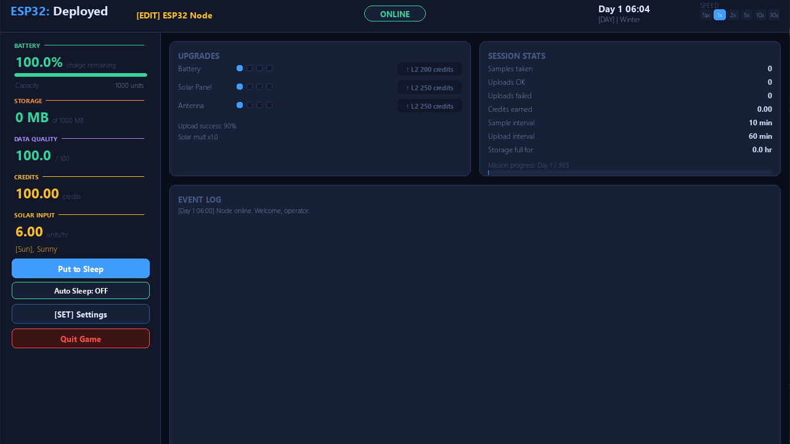

# ESP32: Deployed

> A single player IoT strategy and resource management simulation built with Python and Pygame.



---

## What is this?

**ESP32: Deployed** puts you in charge of a remote ESP32 sensor node deployed somewhere in the field. Your job is simple; keeping it alive, keeping it uploading data, and surviving 365 in-game days.

But it's not that simple.

Your node runs on a battery charged by a solar panel. It samples data, stores it, and uploads over Wi-Fi. Weather changes. Dust accumulates on your solar panel. Birds nest on you antenna. Wi-Fi towers go down. Batteries get damaged. And through all of it, you have to manage your energy, your storage, your data quality, and your credits by balancing upgrades and repairs.

This is not an action game. It's a slow, strategic simulation where every decision compounds over time. Sleep the node too long and your data quality crumbles. Sample too aggressively and your battery dies before sunrise. Ignore an event and watch your upload success rate nosedive. 

---

## How to Play / Run

### Option 1: Download and Play (Windows only)

1. Download the executable directly: 
    **[Download ESP32-Deployed.exe](https://github.com/razihaider14/ESP32-Deployed/releases/download/v1.0/ESP32-Deployed.exe)**

2. Double click the downloaded `ESP32-Deployed.exe` to launch.

> **Note:** Windows Defender may show a warning 🥀. Becuase the exe is unsigned. Click **More Info → Run Anyway** to proceed. This is normal.

---

### Option 2: Run from source (Windows / Mac / Linux)

#### Prerequisites
- Python 3.10 or higher. [Download here](https://www.python.org/downloads/)
- VS Code (Or another IDE). [Download here](https://code.visualstudio.com/)
- Python extension for VS Code. Search **"Python"** by Microsoft in the Extensions tab

#### Steps

1. **Clone or download the repo**
```
git clone https://github.com/razihaider14/ESP32-Deployed.git
```
Or click **Code → Download ZIP** and extract it.

2. **Install dependencies**
Open a terminal in the project folder and run:
```
pip install -r requirements.txt
```

3. **Run the game**
    - Open the project folder in VS Code.
    - Open `main.py`.
    - Press Click the play / run button in the top right.
    - Or in the terminal:
    ```
    python main.py
    ```

#### Required files
Make sure all of these files are in the same folder:
```
main.py
node.py
ui.py
constants.py
events.py
weather.py
requirements.txt
```

---

## Features

### IoT Dashboard Interface
The game uses a clean, modern dashboard UI inspired by Home Assistant and Grafana. Everything is kept visible at a glance; battery, storage, data quality, credits, solar input, weather, time, season, node status, upgrades, and a live event log. No menus to dig through. No hidden stats.

### Node Management
- **Rename your node** : click the `[EDIT]` tag next to the node name in the top bar to give your node a custom name at any time.
- **Node status** : the status pill in the top center shows `ONLINE`, `SLEEPING`, or `AUTO` at all times.
- **Manual sleep** : put the node to sleep manually to conserve battery at the cost of data quality.
- **Auto sleep mode** : enable auto sleep and the node will automatically sleep between tasks, waking only when a sample or upload is due. Saves significant battery with a small data quality tradeoff.

### Battery System
- The node starts with **1000 battery units**.
- Battery is displayed as a **percentage**, but it's internally managed as units.
- Awake mode drains **0.05 units/min**. Sleep mode drains **0.005 units/min**. Auto sleep drains **0.01 units/min**.
- If battery hits 0, the node goes offline and you lose.
- **Battery upgrades** increase max capacity and fully recharge the battery on upgrade.

### Solar Charging
- Solar charging only occurs during **daytime (06:00-18:00)**.
- Generation depends on **weather**: Sunny +6/hr, Cloudy +3/hr, Rainy +1/hr, Storm +0/hr.
- **Solar panel upgrades** multiply generation: L1 = 1.0x, L2 = 1.25x, L3 = 1.5x, L4 = 2.0x.
- Solar generation is reduced by dust events and damage events.

### Sampling and Storage
- The node takes a sample every **sample interval** minutes (player-controlled, default 10 min).
- Each sample costs **0.1 battery units** and generates **1 MB** of stored data.
- Storage capacity is **1000 MB**. When full, sampling stops.
- If storage remains full for **7 consecutive in-game days**, you lose.

### Uploading
- The node uploads all stored data every **upload interval** minutes (player-controlled, default 60 min).
- Upload energy cost is **(1.0 + 0.005 x MB) x antenna cost multiplier**.
- Upload success depends on **antenna level** and active events.
- On success: storage is cleared, credits are earned, data quality improves slightly.
- On faliure: storage is cleared (data lost), data quality drops, no credits earned.

### Data Quality
Data Quality (DQ) ranges from 0 to 100 and is central to the game's economy.

- **Increases** slightly with each sample and each successful upload.
- **Decreases** on failed uploads, when storage is full, when the node is idle too long, when sleeping manually, and from sensor drift events.
- **Upload rewards scale with DQ** high quality data earns more credits.
- If DQ drops below **20**, you lose.
- To win, you must maintain DQ above **50** till the 365th day.

### Credits and Upgrades
Credits are earned from successfull uploads using the formula:
```
Reward = (Uploaded MB x Data Quality) / 1000
```
Small uploads produce very small rewards intentionally, so farming is not viable.

Credits are spent on upgrades and event fixes:

| Upgrade | L2 | L3 | L4|
|---|---|---|---|
| Battery | 200 credits | 500 credits | 1000 credits |
| Solar Panel | 250 credits | 600 credits | 1200 credits |
| Antenna | 250 credits | 600 credits | 1200 credits |

**Battery upgrades** increase capacity (1000 → 1500 → 2000 → 3000 units) and fully recharge on upgrade. They also auto-fix battery damage events.
**Solar panel upgrades** multiply solar generation and auto-fix dust and solar damage events.
**Antenna upgrades** improve upload success rate (90% → 94% → 97% → 99%), reduce upload energy cost, and auto-fix WiFi and bird nest events.

### Weather and Seasons
- Weather changes every **2 in-game hours** based on the current season. 
- **4 seasons**, each ~ 91 days long. The starting season is **random** every game.
- Season affects weather probabilities:
  - **Summer** : mostly sunny, rare storms
  - **Spring** : mix of sun and rain
  - **Autumn** : more clouds and rain
  - **Winter** : frequent rain and storms, rare sun
- **Sunny weather never occurs at night.**
- **Rain and storms automatically fix dust events** on the solar panel.
- The current season and day/night status are shown in the top bar.

### Events
Events are random field conditions that penalize your node until fixed.

**Minor events** (80% chance per week):
| Event | Penalty | Fix Cost |
|---|---|---|
| Light Dust on Panel | Solar - 10% | 25 credits |
| Heavy Dust on Panel | Solar - 30% | 100 credits |
| Minor WiFi Tower Issue | Upload Success - 10% | 50 credits |
| Sensor Drift | DQ drains over time | 120 credits |
| Bird Nest on Antenna | Upload Success - 20% | 75 credits |

**Major events** (10% chance per month):
| Event | Penalty | Fix Cost |
|---|---|---|
| Major WiFi Tower Failure | Upload Success - 50% | 200 credits |
| Battery Damage | Battery capacity - 10% | 300 credits |
| Solar Panel Damage | Solar generation - 50% | 250 credits |

- Events appear as popups when they trigger; you can fix them immediately or ignore them and keep the penalty.
- Active events are shown as individual buttons in the sidebar; click any one to reopen its popup and fix it later.
- Multiple events stack their penalties.

### Time Control
- The in-game clock runs at **1 game minute per real second** at 1x speed.
- Speed can be changed at any time: ½x, 1x, 2x, 5x, 10x, 30x**.
- All mechanics (energy, solar, sampling, uploads, events) scale proportionally with speed, nothing breaks at high speed.

### Win and Lose Conditions

**You win** by surviving until **Day 365** with:
- Battery above 0
- Data Quality above 50

**You lose immediately** if:
- Battery reaches 0 : *"Battery depleted - node offline."*
- Data Quality drops below 20 : *"Data Quality critically low - mission falied."*
- Storage full for 7 consecutive in-game days : *"Storage full for 7 days - data integrity lost."*

**Carry-over:** If you win, your credits carry over to the next game as a headstart.

---

## Controls and UI Guide

| Action | How |
|---|---|
| Rename node | Click `[EDIT]` next to node name |
| Change time speed | Click speed buttons (top right) |
| Put node to sleep | Click **Put to Sleep** in sidebar |
| Toggle auto sleep | Click **Auto Sleep: ON/OFF** in sidebar |
| Open settings | Click **[SET] Settings** in sidebar |
| Change sample interval | Settings → type minutes → Apply |
| Change upload interval | Settings → type minutes → Apply |
| Buy upgrades | Click upgrade buttons in Upgrades card |
| Fix an event | Click event button in sidebar → Fix |
| Quit | Click **Quit Game** in sidebar|

---

## Project Structure

```
ESP32-Deployed/
├── main.py
├── node.py
├── ui.py
├── constants.py
├── events.py
├── weather.py
├── requirements.txt
└── Images/
    └── ui.png
```

---

## Built With

- **Python 3.10+**
- **Pygame** (rendering, input, game loop)

---

## License

MIT License, see `LICENSE` for details.